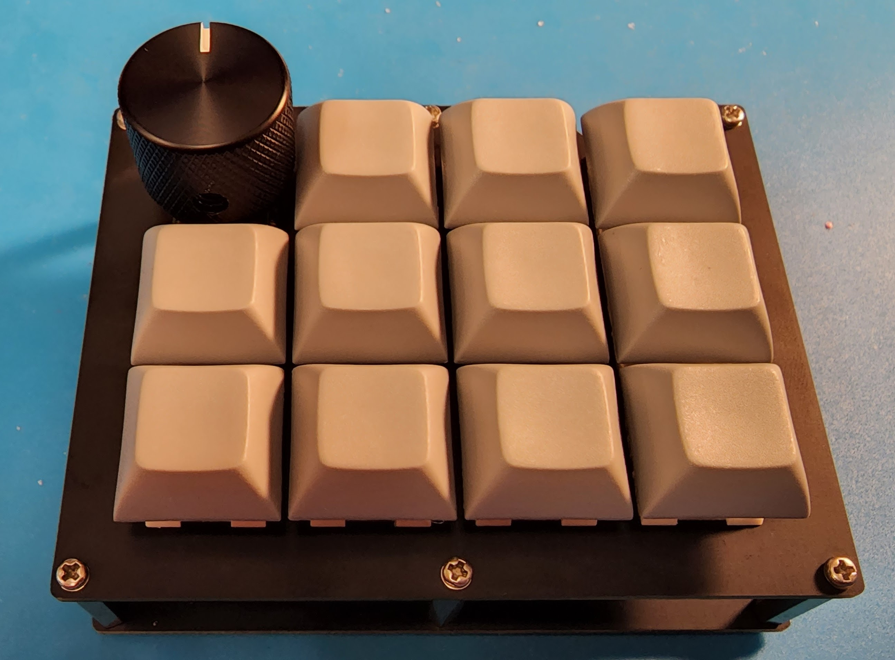
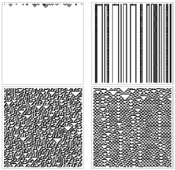

--- 
title: Projects
permalink: /projects/
---

## Matricks

Matricks is an LED matrix control and simulation platform designed for user-extensible LED matrix control, intended to replace [vid2led](#vid2led).
Users can develop custom plugins to define complex and interactive behaviors. 
Matricks was written in Rust, and uses [Extism](https://extism.org) to interact with user plugins. 

## Pluto12 Macropad
{: style="float: left; padding: 10px;" width="48%" }
The Pluto12 is a 12-key macropad with optional rotary encoder. 
Designed on a tight budget for the Penn State IEEE Student Chapter's 2020-2021 workshop series, the Pluto12 uses an FR4 integrated plate mount design that can be printed with the main circuit board for cost savings.
The project has been officially recognized and supported by the open source [QMK Project](https://github.com/qmk/qmk_firmware/tree/master/keyboards/psuieee/pluto12).

## vid2led

{: style="float: right; padding: 10px;" width="51%" } 
[vid2led](https://github.com/wymcg/vid2led) is a tool designed to run on Raspberry Pi devices to display any `.mp4` video on WS281x LED matrices.
It was developed for the Penn State IEEE Student Chapter on a tight timeline as part of their THON 2023 efforts, after attempts to use existing solutions fell through.
vid2led was written in Python and uses OpenCV to process video into color data.

## WolfECA
{: style="float: left; padding: 10px;" width="48%" }
A command line tool written in Rust to simulate elementary cellular automata based on their Wolfram code and save the output to an image file. 
The project was developed to investigate elementary cellular automata and to learn CLI development with Clap.

## Other Projects
Check out my other projects on my [GitHub](https://github.com/wymcg)!